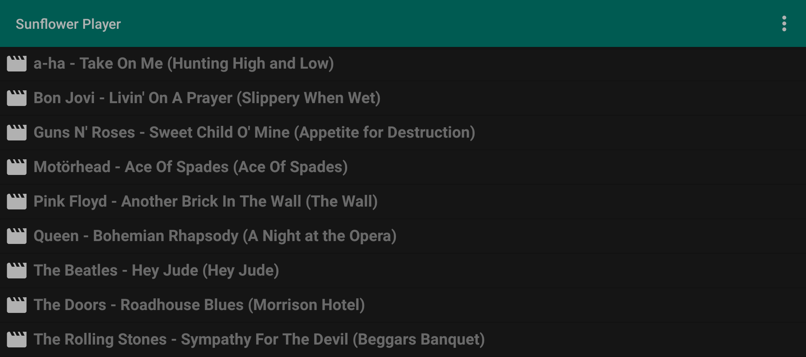

<a name="readme"/>

# 

**Sunflower Player** is a video player for Android that sends the system
information about the playing video as a music track, which makes it possible to
use it as a music video player, easily detected by the most scrobbler apps for
services like Last.fm. The application has a simple file viewer, is able to
extract simple tags from the file name, allows to manually create and edit tags,
contains tools to ease the tag creation, and also allows to create a backup of the
database of saved tags. The application has a simple architecture and aims to be
fast and easy to use. During development, special attention was paid to the
simplicity and readability of the code, as well as the ease of support. The
project is covered by unit tests and documented.

<p align="center">
  
</p>

## Table of Contents

[How it works](#how-it-works)  
[Features](#features)  
[Architecture](#architecture)  
[Code style](#style)  
[Getting started](#getting-started)  
[Internationalization](#internationalization)  
[TODO](#todo)  
[License](#license)  
[Contribution](#contribution)

<a name="how-it-works"/>

## How it works

The following technologies are used in the project:

- [ExoPlayer](https://github.com/google/ExoPlayer) for video player
  implementation;
- [greenDAO](https://github.com/greenrobot/greenDAO) as an ORM solution;
- [gson](https://github.com/google/gson) for JSON serialization/deserialization;
- [Lombok](https://projectlombok.org) to avoid boilerplate code;
- [JUnit](https://junit.org/junit5/) for writing unit/integration tests;
- [Powermock](https://github.com/powermock/powermock) for creating a mock objects
  in the unit/integration tests.

Gradle is used to automatically build the project.

<a name="features"/>

## Features

- A simple and intuitive user interface, which alerts the users about errors,
  warns about the possible irreversibility of operations, and informs about the
  successful completion of actions, the result of which is not obvious;
- Users can add tags to video files;
- A simple file manager for navigating through folders and selecting music
  videos to watch, which shows previously saved tags for the video files, or
  tries to recognize and show tags from the filename if it matches
  the `artist - title` pattern;
- An option to quickly set the album tag equal to the music video title using
  the context menu, which allows to set tags for most music videos with a couple
  of taps, since music videos are most often made for songs from singles/albums
  with the same name;
- An option to quickly find a list of albums of the music video's artist via
  context menu, using the information from already saved tags, so user
  can select the proper album and set it in the tags of the video, which
  allows to set tags for music videos in a couple of taps, if the tag
  containing the needed album has already been saved at least once;
- Screen orientation is locked in album mode - no need to constantly flip the
  screen when navigating/exiting the file viewer or settings menu;
- Users can create and load backups of saved tags;
- Users can reset the database of saved tags;
- Users can customize the default directory of the application;
- An information about the played videos is picked up by third-party scrobblers
  without any problems;
- The application works seamlessly with third-party audio equalizers;
- Support for all popular video formats;
  see [ExoPlayer documentation](https://exoplayer.dev/supported-formats.html)
  for details.

<a name="architecture"/>

## Architecture

- A clean package structure, with classes organized by purpose, area of
  responsibility, and level of abstraction;
- Following the principles of separation of concerns and loose coupling;
- A focus on generally accepted good coding principles and design patterns;
- Following encapsulation principles to provide convenient and secure
  interfaces.

<a name="style"/>

## Code style

- Focus to write simple and readable code;
- Simple and meaningful names of classes, methods and variables, separation of
  different aspects of functionality to separate methods;
- The code is accompanied by documentation, with complex points accompanied by
  comments;
- Separation of complex code constructs into several primitive parts for better
  understanding, the code is also separated by purpose;
- Limiting the number of characters by line width for better readability;
- Avoiding "spaghetti code" (nested ifs);
- Using Lombok to avoid boilerplate code.

<a name="getting-started"/>

## Getting started

Android 7.1 or above is required.

### Build

```bash
gradlew assembleDebug
```

File should be created at: app\build\outputs\apk\debug\app-debug.apk.

### Run tests

```bash
gradlew test
```

#### Add new video extensions

By default, only video files with extensions `m4v`, `mp4` and `mkv`, `webm`,
`ts` and `flv` are supported, but since the application uses the all powerful
ExoPlayer functionality, it is also capable of
playing [files with less popular extensions](https://exoplayer.dev/supported-formats.html).
To add support for a required extension, simply edit the array in the
app\src\main\java\com\artyommameev\sunflowerplayer\storage\FileManager.java
file:

```java
    public static final String[] VIDEO_EXTENSIONS = {"m4v", "mp4", "mkv",
            "webm", "ts", "flv"};
```

<a name="internationalization"/>

## Internationalization

The app supports internationalization. If you want to translate the application,
create a folder `values-**` in the app\src\main\res directory, where `**` is a
two-letter language designation, for example `values-fr` for French
or `values-ja` for Japanese. Then copy the file `strings.xml` from the
app\src\main\res\values directory to this folder - it contains all the strings
for translation.

<a name="todo"/>

## TODO

- [ ] Write integration tests for activities logic.
- [ ] Implement automatic search for tags in the MusicBrainz database.

<a name="license"/>

## License

Copyright ©2022 Artyom Mameev.  
Licensed under the [MIT License](https://opensource.org/licenses/MIT).

`PlayerService` code was taken from
[AndroidAudioExample](https://github.com/SergeyVinyar/AndroidAudioExample)
which is licensed under the
[MIT License](https://opensource.org/licenses/MIT).

`TreeUriHelper` code was taken from
[Augendiagnose](https://github.com/jeisfeld/Augendiagnose)
which is licensed under the
[GPL-2.0 license](https://www.gnu.org/licenses/old-licenses/gpl-2.0.en.html).

`MediaStyleHelper` code was taken from
[ianhanniballake's repository](https://gist.github.com/ianhanniballake/47617ec3488e0257325c).

<a href="https://www.flaticon.com/free-icons/flower" title="flower icons">Flower
icons were created by Vitaly Gorbachev - Flaticon</a>.

<a name="contribution"/>

## Contribution

Any contributions to the project are welcome.
